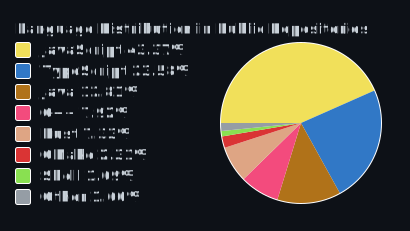

# przxmus

[Explore my projects](https://github.com/przxmus?tab=repositories) | [Website](https://przxmus.dev)

## Languages I use

 

## All Projects

- [tipply-sdk-ts](https://github.com/przxmus/tipply-sdk-ts) - Unofficial TypeScript library/SDK for polish donation service Tipply.pl.
- [better-markers](https://github.com/przxmus/better-markers) - OBS plugin for better marker workflow, making videos easy to later cut in editing software.
- [tipply-streamdeck](https://github.com/przxmus/tipply-streamdeck) - Streamdeck plugin for managing tips on polish donation service Tipply.pl.
- [minecraft-asset-explorer](https://github.com/przxmus/minecraft-asset-explorer) - Minecraft desktop asset exploration and export tool.
- [nick-hider](https://github.com/przxmus/nick-hider) - Client-side identity masking mod for Minecraft.
- [openthumbnail](https://github.com/przxmus/openthumbnail) - AI-assisted thumbnail generation and editing web app.
- [P-LifeSteal](https://github.com/przxmus/P-LifeSteal) - Configurable life-steal Minecraft plugin.
- [marker-fixer](https://github.com/przxmus/marker-fixer) - OBS-to-Premiere marker conversion CLI for creator workflows.

## Contact

- Website: [przxmus.dev](https://przxmus.dev)
- GitHub: [@przxmus](https://github.com/przxmus)
- Discord: @przxmus
- E-Mail: przxmus@icloud.com
