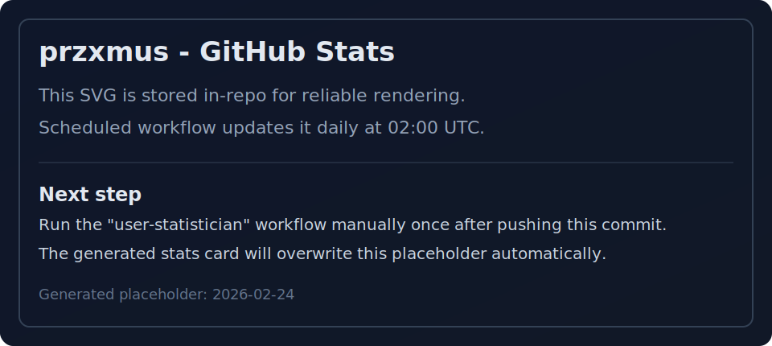

# przxmus

[Explore my projects](https://github.com/przxmus?tab=repositories) | [Website](https://przxmus.dev)

## GitHub Stats

 

## Featured Projects

### [minecraft-asset-explorer](https://github.com/przxmus/minecraft-asset-explorer)

Desktop asset browser for Minecraft instances and modpacks. It scans vanilla, mod, and resource-pack files, then lets users preview and export assets quickly.

`Rust` `Desktop` `Minecraft` `Content Creators`  
[Latest release](https://github.com/przxmus/minecraft-asset-explorer/releases/latest)

### [marker-fixer](https://github.com/przxmus/marker-fixer)

Rust CLI that converts OBS MP4 chapter markers into Premiere Pro-compatible XMP markers without re-encoding video, designed for creator post-production workflows.

`Rust` `CLI` `Content Creators`  
[Latest release](https://github.com/przxmus/marker-fixer/releases/latest)

### [nick-hider](https://github.com/przxmus/nick-hider)

Multi-loader Minecraft mod focused on player identity masking (name, skin, cape) with stable releases and practical client-side privacy controls.

`Java` `Minecraft` `Content Creators`  
[Latest release](https://github.com/przxmus/nick-hider/releases/latest) | [Modrinth](https://modrinth.com/project/tRP3LbwW)

### [openthumbnail](https://github.com/przxmus/openthumbnail)

Local-first thumbnail workshop for YouTube creators with OpenRouter image generation, editing workflow, and export tooling.

`TypeScript` `Web` `AI` `Content Creators`  
[Live demo](https://openthumbnail.przxmus.dev)

### [P-LifeSteal](https://github.com/przxmus/P-LifeSteal)

A widely used Minecraft life-steal plugin with sustained community adoption. This project represents the strongest historical traction in my portfolio.

`Java` `Minecraft` `Server Plugin`  
[Docs](https://devprzemus.gitbook.io/lifesteal/) | [Releases](https://github.com/przxmus/P-LifeSteal/releases)

## All Projects

- [minecraft-asset-explorer](https://github.com/przxmus/minecraft-asset-explorer) - Minecraft desktop asset exploration and export tool.
- [marker-fixer](https://github.com/przxmus/marker-fixer) - OBS-to-Premiere marker conversion CLI for creator workflows.
- [nick-hider](https://github.com/przxmus/nick-hider) - Client-side identity masking mod for Minecraft.
- [openthumbnail](https://github.com/przxmus/openthumbnail) - AI-assisted thumbnail generation and editing web app.
- [P-LifeSteal](https://github.com/przxmus/P-LifeSteal) - Configurable life-steal Minecraft plugin with strong community footprint.

## Contact

- Website: [przxmus.dev](https://przxmus.dev)
- Discord: @przxmus
- GitHub: [@przxmus](https://github.com/przxmus)
